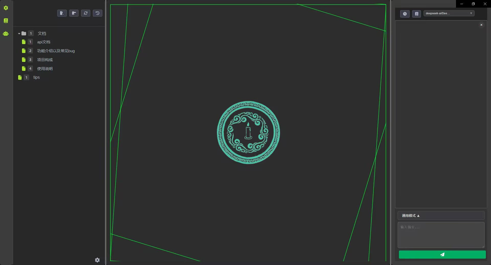

# 青烛 v0.2.0


## 项目介绍

青烛(正式名)是一个文本创作工具，主要探索AI在文本创作领域的应用。

**核心功能**:
*   **AI 智能交互**: 与AI进行实时对话，辅助创作。
*   **章节管理**: 创建、编辑、删除和组织章节。
*   **内容编辑器**: 强大的文本编辑功能，ai操作友好，非技术用户使用体验略逊
*   **工具调用**: 支持类似 vibecoding 的工具调用解决问题，目前部分功能仍在完善中。

## 技术栈

### 前端技术
*   **React**: 前端主流框架之一
*   **Redux**: 前端状态管理库
*   **Tailwind CSS**: CSS框架
*   **monaco-editor**: vscode同款编辑器

### 后端技术
*   **FastAPI**: python服务器框架
*   **LangChain**: 用于构建AI应用的工具链
*   **LangGraph**: 基于图的AI工作流编排框架
*   **LanceDB**: 向量数据库，提供语义搜索和知识库管理


## 已知问题

以下是目前已知但暂未修复的问题：

- **工具调用功能不完善**: 部分工具调用功能仍在开发中，可能存在不稳定的情况
- **错误处理**: 部分异常情况的错误提示不够友好，偶尔有前后端连不上的情况

## 后续发展规划

### 短期目标（v0.2.0）
- 清理前后端大量低效代码
- 重构langgraph板块，使用官方在1.0推荐的最佳实践
- 完善工具调用功能，提高稳定性
- 改进错误提示和用户引导
- 更稳定的前后端连接
- 两步rag & 工具rag，两种rag检索并存
- 部分功能自动化测试

### 中期目标（v0.3.0）
- 可视化工作流编辑器（类dify）
- 更灵活的AI聊天功能（类酒馆？？？）
- 更好的文本编辑体验（类obsidian）

### 长期目标（v1.0.0）
- 暂无


## 快速开始

### 安装&启动

1.  **克隆仓库**:
    ```bash
    git clone git@github.com:FlickeringLamp/ai-novelist.git
    cd ai-novelist
    ```


2.  **安装前端依赖**:
    进入前端目录 (`frontend/`) 并安装依赖,构建前端，启动：
    ```bash
    cd frontend
    npm install
    npm run build
    npm start
    ```


3.  **安装后端依赖**:
    从根目录(`ai-novelist`)创建虚拟环境，激活，并安装后端依赖,回到根目录，启动：
    ```bash
    python -m venv backend_env
    backend_env\Scripts\activate
    cd backend
    pip install -r requirements.txt
    cd ..
    python main.py
    ```

5. **浏览器访问**：
    浏览器访问localhost:3000


## 贡献

我们欢迎各种形式的贡献！如果您发现 Bug、有功能建议或希望提交代码，请随时通过 GitHub Issues 或 Pull Requests 参与。

为了保持项目的健康发展，请确保：
- 提交的代码与 [MIT 协议](LICENSE) 兼容
- 避免引入与 MIT 协议不兼容的代码

**关于 DCO 的说明**：先前本项目有 DCO（开发者来源证书）要求，但检查未正确移除。现已完全移除所有 DCO 检查和要求。贡献者不再需要在提交时进行签名确认。

感谢每一位贡献者的支持！

## 许可证

本项目采用 [MIT 许可证](LICENSE)。


---

## 致谢 (Acknowledgements)

本项目的开发在很大程度上借鉴了 `roo-code` 项目。我们对 `roo-code` 的开发者们表示衷心的感谢。

`roo-code` 项目基于 Apache License 2.0 开源。根据其许可证要求，我们在项目中包含了其原始的许可证声明，您可以在 [`LICENSE-roo-code.txt`](./LICENSE-roo-code.txt) 文件中查看。

## Acknowledgements

This project is heavily inspired by and based on the work of the `roo-code` project. We extend our sincere gratitude to the developers of `roo-code`.

The `roo-code` project is licensed under the Apache License, Version 2.0. In compliance with its terms, we have included the original license notice within our project, which can be found in the [`LICENSE-roo-code.txt`](./LICENSE-roo-code.txt) file.