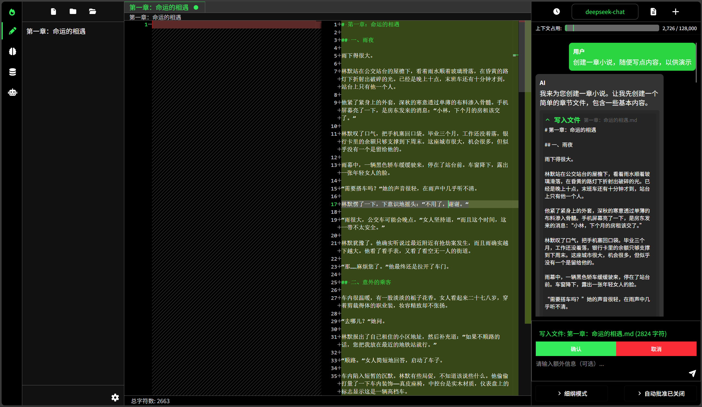

# 青烛 v0.2.0


## 项目介绍

青烛(正式名)是一个文本创作工具，主要探索AI在文本创作领域的应用。

**核心功能**:
*   **AI 智能交互**: 与AI进行实时对话，辅助创作。
*   **章节管理**: 创建、编辑、删除和组织章节。
*   **内容编辑器**: 强大的文本编辑功能，ai操作友好，非技术用户使用体验略逊
*   **工具调用**: 支持类似 vibecoding 的工具调用解决问题，目前部分功能仍在完善中。
*   **rag知识库**: 允许ai获得相关资料，提升效果

## 技术栈

### 前端技术 (TypeScript)
*   **React**: 前端主流框架之一
*   **Redux**: 前端状态管理库
*   **Tailwind CSS**: CSS框架
*   **monaco-editor**: vscode同款编辑器

### 后端技术 (python)
*   **FastAPI**: python服务器框架
*   **LangChain**: 用于构建AI应用的工具链
*   **LangGraph**: 基于图的AI工作流编排框架
*   **ChromaDB**: 向量数据库，提供语义搜索和知识库管理


## Languages
Date : 2026-02-14 11:56:11
Total : 134 files,  11085 codes, 1762 comments, 1932 blanks, all 14779 lines

| language | files | code | comment | blank | total |
| :--- | ---: | ---: | ---: | ---: | ---: |
| TypeScript JSX | 56 | 5,413 | 329 | 676 | 6,418 |
| Python | 42 | 3,207 | 1,146 | 784 | 5,137 |
| TypeScript | 17 | 1,291 | 201 | 216 | 1,708 |
| Markdown | 7 | 775 | 0 | 201 | 976 |
| PostCSS | 4 | 180 | 18 | 29 | 227 |
| JavaScript | 4 | 78 | 44 | 12 | 134 |
| JSON | 1 | 78 | 0 | 1 | 79 |
| JSON with Comments | 1 | 29 | 19 | 7 | 55 |
| Ignore | 1 | 20 | 5 | 5 | 30 |
| HTML | 1 | 14 | 0 | 1 | 15 |


## 项目结构(2026.1.26)

前端：
📦src
 ┣ 📂components                           # 组件文件夹
 ┃ ┣ 📂agent                              ## agent面板
 ┃ ┃ ┣ 📜AgentPanel.tsx                   ### 1. agent主面板文件
 ┃ ┃ ┣ 📂common
 ┃ ┃ ┣ 📂parameterTab                     ### 2. 参数管理面板
 ┃ ┃ ┣ 📂toolTab                          ### 3. 工具管理面板
 ┃ ┃ ┣ 📜FileSelector.tsx
 ┃ ┃ ┗ 📜ModeManager.ts
 ┃ ┣ 📂aiprovider                         ## api提供商面板
 ┃ ┃ ┗ 📜ProviderSettingsPanel.tsx
 ┃ ┣ 📂chapter                            ## 章节栏
 ┃ ┃ ┣ 📜ChapterTreePanel.tsx             ### 1. 文件主面板
 ┃ ┃ ┣ 📜ChapterContextMenu.tsx           ### 1.1 文件右键菜单
 ┃ ┃ ┗ 📜TreeRender.tsx                   ### 1.2 文件树渲染
 ┃ ┣ 📂chat                               ## 聊天栏
 ┃ ┃ ┣ 📂header                           ### 1. 顶部框
 ┃ ┃ ┣ 📂messagedisplay                   ### 2. 消息框
 ┃ ┃ ┣ 📂input                            ### 3. 输入框
 ┃ ┃ ┗ 📜ChatPanel.tsx                    ### 4. 主聊天面板
 ┃ ┣ 📂editor
 ┃ ┃ ┣ 📂editor
 ┃ ┃ ┃ ┣ 📜CoreEditor.tsx
 ┃ ┃ ┃ ┣ 📜EditorArea.tsx
 ┃ ┃ ┃ ┗ 📜StatusBar.tsx
 ┃ ┃ ┣ 📂tab
 ┃ ┃ ┃ ┗ 📜CloseTabConfirmModal.tsx
 ┃ ┃ ┣ 📜EditorContextMenu.tsx
 ┃ ┃ ┗ 📜EditorPanel.tsx
 ┃ ┣ 📂others
 ┃ ┃ ┣ 📜ContextMenu.tsx
 ┃ ┃ ┣ 📜ErrorModal.tsx
 ┃ ┃ ┣ 📜Logo.css
 ┃ ┃ ┣ 📜Logo.tsx
 ┃ ┃ ┗ 📜UnifiedModal.tsx
 ┃ ┣ 📂rag
 ┃ ┃ ┗ 📜RagManagementPanel.tsx
 ┃ ┣ 📜LayoutComponent.tsx
 ┃ ┗ 📜SidebarComponent.tsx
 ┣ 📂context // 主题上下文
 ┃ ┗ 📜ThemeContext.tsx
 ┣ 📂store // redux状态管理
 ┃ ┣ 📜editor.ts
 ┃ ┣ 📜file.ts
 ┃ ┗ 📜store.ts
 ┣ 📂utils // 工具函数
 ┃ ┣ 📜DisplayNameHelper.ts
 ┃ ┣ 📜embeddingModelUtils.ts
 ┃ ┗ 📜httpClient.ts
 ┣ 📜App.css
 ┣ 📜App.tsx
 ┣ 📜css.d.ts
 ┣ 📜index.css
 ┗ 📜index.tsx


## 已知问题

以下是目前已知但暂未修复的问题：

- **工具调用功能不完善**: 部分工具功能与其他功能（章节栏，标签页等）不协调
- **聊天栏功能不完善**：目前回档，文件路径补全，暂未实现

## 后续发展规划

### 短期目标（v0.2.0）
- 完善工具调用功能（2026/2/22）
    - write_file工具
        - 标签栏多了怎么处理，先看看两个栏的情况会创到哪里吧（）
    - 其他文件操作工具（）
    - 四个文件操作工具，需要支持用户介入（）
    - 回档对话（）


- 完成聊天栏全部功能
    - 输入栏的自动补全文件路径（）
    - 系统提示词构建，需要将editor里面的标签也写进去（）
    - 有时候，渲染有问题，会渲染几个操作面板的残留部分————使用路由或许会好些（）
- 部分功能自动化测试

### 中期目标（v0.3.0）
- 可视化工作流编辑器（类dify）
- 更灵活的AI聊天功能（类酒馆？？？）
- mcp，skills功能
- 工具加强
    - apply_diff允许不按行号进行相似度匹配，然后成功应用并提醒行号错误
    - 新增memory_edit工具，允许ai直接编辑自己的上下文（？）
    - search_file & search_and_replace功能优化
    - ask_user消息显示，可以改成类roo code那样的选项卡
    - 新增工具，读取某个目录下的所有问题（同时需要优化系统提示词构建，当文件太多时，只显示100个，多余的用工具获取。）
    - 探索@tool()的其他参数，尤其是description(需要阅读langchain/langgraph官方文档)
    - search_file，应该返回相对novel的路径，而不是这种：backend\data\novel\test.md:23
    - 合并两个搜索工具（？）暂时不合并，合并的话，前端的editor显示会很麻烦
    - 多个ai同时修改文件（？）
    - bug————当ai先前使用过工具（假如write_file），后续关闭使用该工具的权限与使用说明。一旦ai试图调用这个关闭的工具，就会报错。但是可控，渲染崩溃后，打开消息，删掉最后一个调用就好。
    - 临时添加工具结果/及时获取工具结果并渲染/中断返回结果时先返回state，让工具结果消息先渲染，再流式渲染中断消息（）
- 总结对话历史()————存在点小问题，比如，保留了倒数第二条消息，但是却显示没有发给ai
- qwen3max，工具调用有问题，可能是模型原因，也可能是ChatTongyi的问题，或许换成ChatQwen能解决？（）
- 减轻ai工具负担（尤其是重复的工具函数文档 和 args_schema）
- 增加专门的删除工具，避免ai混用

### 长期目标（v1.0.0）
- 暂无


## 快速开始

### 安装&启动

1.  **克隆仓库**:
    ```bash
    git clone git@github.com:FlickeringLamp/ai-novelist.git
    cd ai-novelist
    ```


2.  **安装前端依赖**:
    进入前端目录 (`frontend/`) 并安装依赖,构建前端，启动：
    ```bash
    cd frontend
    npm install
    npm run build
    npm start
    ```


3.  **安装后端依赖**:
    从根目录(`ai-novelist`)创建虚拟环境，激活，并安装后端依赖,回到根目录，启动：
    ```bash
    python -m venv backend_env
    backend_env\Scripts\activate
    cd backend
    pip install -r requirements.txt
    cd ..
    python main.py
    ```

5. **浏览器访问**：
    浏览器访问localhost:3000


## 贡献

我们欢迎各种形式的贡献！如果您发现 Bug、有功能建议或希望提交代码，请随时通过 GitHub Issues 或 Pull Requests 参与。

为了保持项目的健康发展，请确保：
- 提交的代码与 [MIT 协议](LICENSE) 兼容
- 避免引入与 MIT 协议不兼容的代码

感谢每一位贡献者的支持！

## 许可证

本项目采用 [MIT 许可证](LICENSE)。


---

## 致谢 (Acknowledgements)

本项目的开发在一定程度上借鉴了 `roo-code` 项目。我们对 `roo-code` 的开发者们表示衷心的感谢。

`roo-code` 项目基于 Apache License 2.0 开源。根据其许可证要求，我们在项目中包含了其原始的许可证声明，您可以在 [`LICENSE-roo-code.txt`](./LICENSE-roo-code.txt) 文件中查看。
