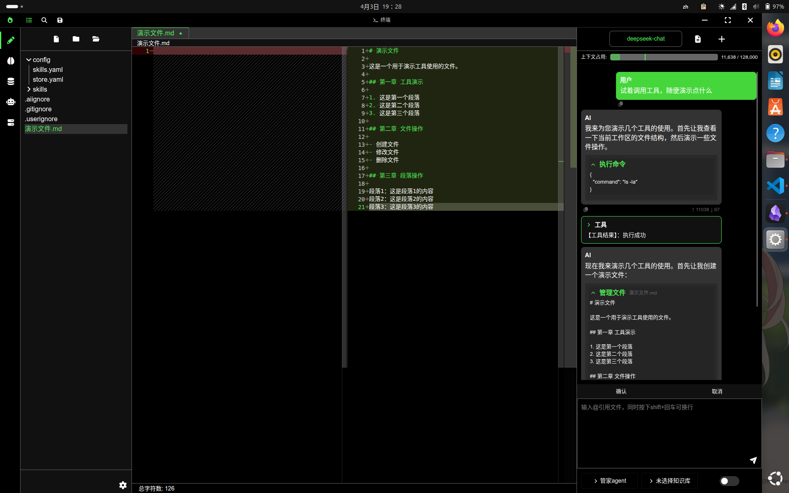
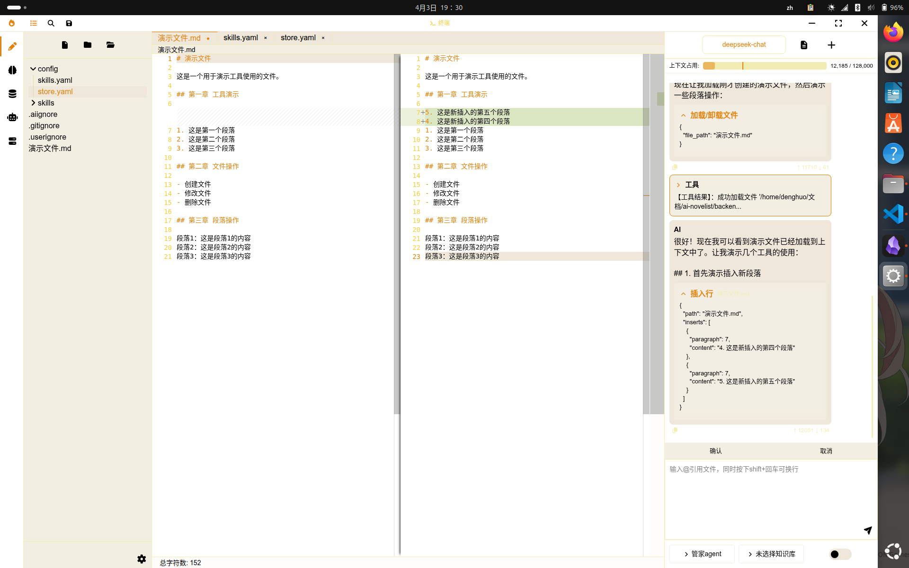
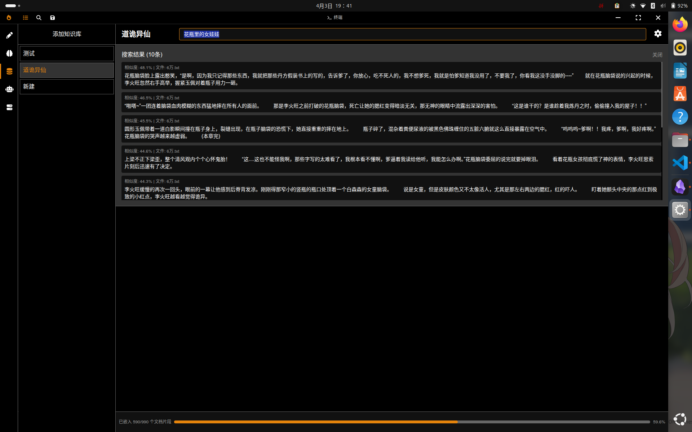
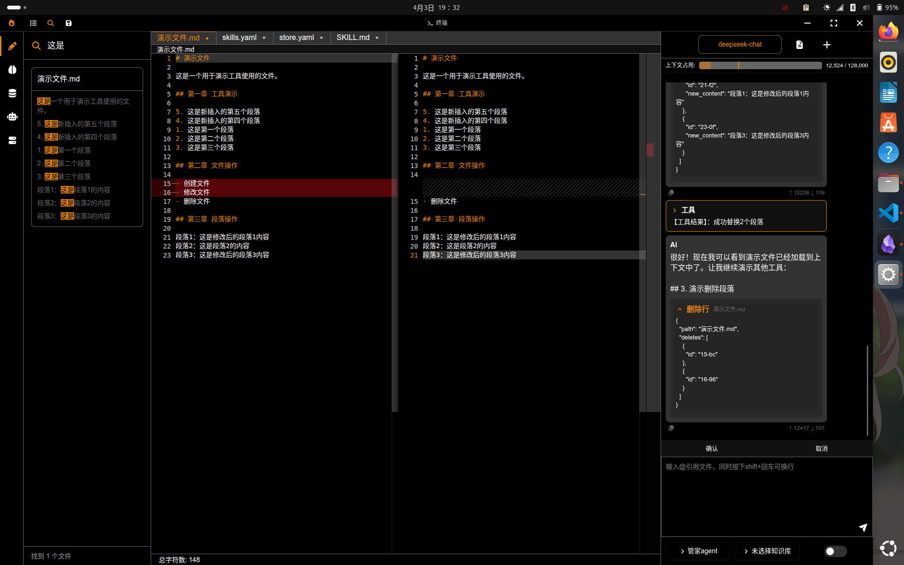
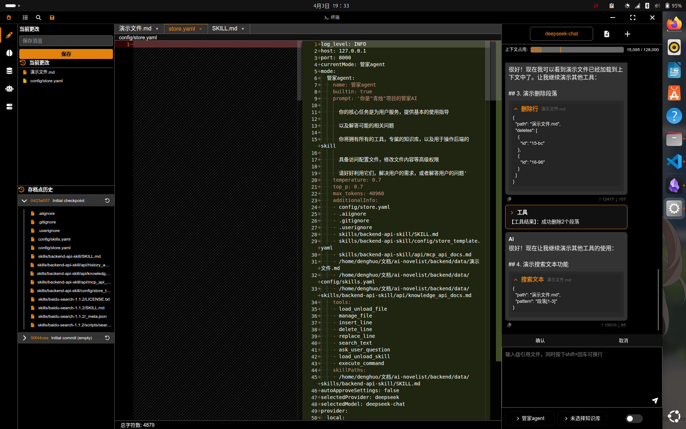
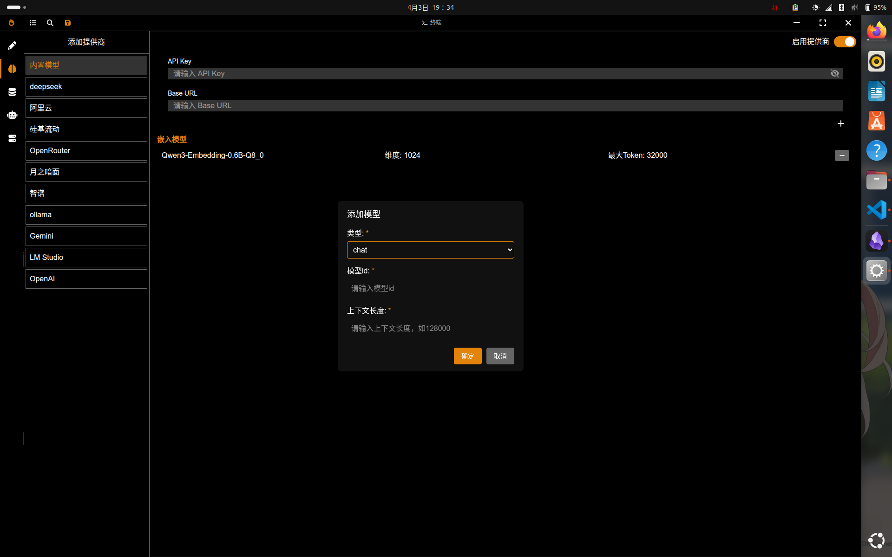
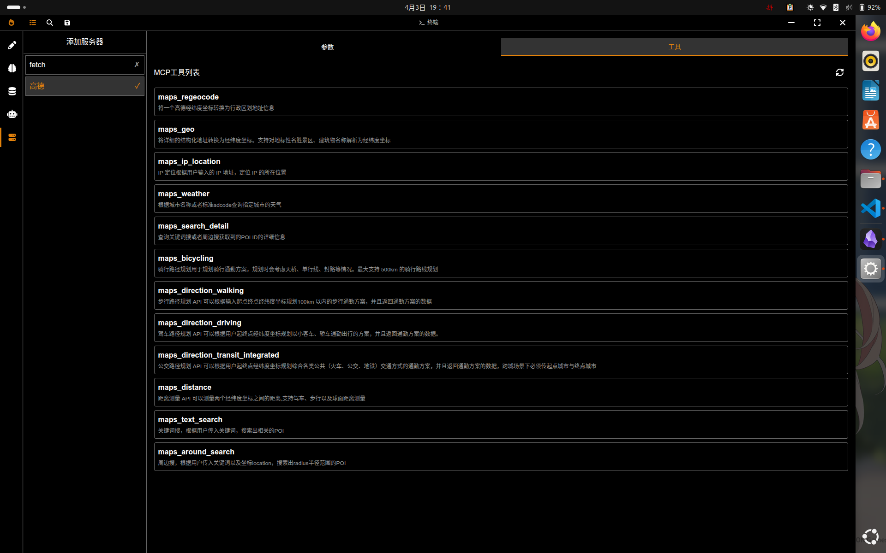
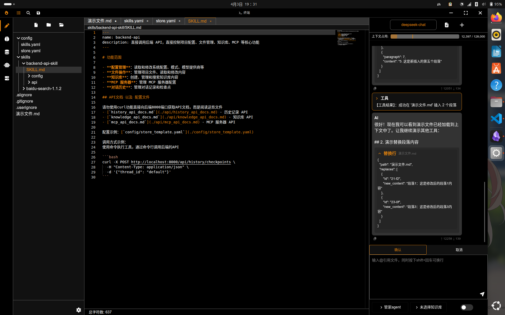

[English](README_EN.md) | **中文**

# 青烛 v0.2.0

## 项目介绍
- 青烛(正式名)是一个文本创作工具，主要探索AI在文本创作领域的应用。
- 可用平台：ubuntu24.04,windows11
- 尊重不同用户的使用习惯，不提供预制的“一键功能”，
- 期待能让AI融入写作流程,提升效率，延伸作者的思考，而非代替作者


# 核心功能
## 0. 内置管家agent
允许AI操作后端API,直接代替用户操作（暂时处在早期阶段）

---

## 1. 工具调用
和cursor/ cline/ roo code/ kilo code等核心逻辑保持一致，部分设计有所出入

- 读取文件工具使用引用更新，无需反复读取，节省token开销，提升正确率
- 借鉴大佬Can Duruk的Hashline方案，差异替换工具无需输出完整旧内容，只需输出两位哈希。进一步节省开销，提升正确率

支持人在回路,鼓励用户频繁介入AI的内容生成，及时纠偏

也可以打开自动批准，让AI完全自动执行任务



---

## 2. 主题
支持日间/夜间模式，以及自定义主题配色



---

## 3. rag知识库
允许ai检索需要的信息，提升效果



- 两步rag: 指的是在调用AI前，将用户消息作为输入，检索相关信息，和其他上下文一并返回给AI
- agentic rag: 赋予AI两个知识库工具，让AI自主决定是否查询数据

---

## 4. 普通搜索

文本编辑器标配功能

允许用户检索文本



---

## 5. 存档点

文本编辑器标配功能

允许用户将文件内容存档，回档，以及查看不同存档点之间的差异



---

## 6. 提供商适配

支持11种提供商

支持自定义提供商(openai兼容)

内置一个嵌入模型,开箱即用



---

## 7. mcp客户端

支持接入mcp服务器



---

## 8. skills支持

可以接入各种skill，和openclaw,claude code类似



---

## 9. 其他：
*   **命令执行**： 允许ai直接执行命令，比如python,npm等
*   **终端**： 类似vscode等编辑器的终端面板，可执行命令行
......

# 技术栈

## 前端技术


## 后端技术


## 开发与构建工具


Total : 215 files,  18327 codes, 3673 comments, 3443 blanks, all 25443 lines

## Languages
| language | files | code | comment | blank | total |
| :--- | ---: | ---: | ---: | ---: | ---: |
| TypeScript JSX | 76 | 8,329 | 627 | 1,022 | 9,978 |
| Python | 63 | 4,458 | 2,210 | 1,349 | 8,017 |
| TypeScript | 38 | 3,060 | 632 | 587 | 4,279 |
| Markdown | 11 | 946 | 0 | 276 | 1,222 |
| JavaScript | 10 | 489 | 91 | 91 | 671 |
| YAML | 3 | 470 | 59 | 37 | 566 |
| PostCSS | 4 | 185 | 19 | 30 | 234 |
| JSON | 3 | 167 | 0 | 2 | 169 |
| PowerShell | 1 | 64 | 11 | 15 | 90 |
| Skill | 2 | 62 | 0 | 21 | 83 |
| pip requirements | 1 | 34 | 0 | 0 | 34 |
| JSON with Comments | 1 | 29 | 19 | 7 | 55 |
| Ignore | 1 | 20 | 5 | 5 | 30 |
| HTML | 1 | 14 | 0 | 1 | 15 |

## 快速开始

### 安装&启动

1.  **克隆仓库**:
    ```bash
    git clone git@github.com:FlickeringLamp/ai-novelist.git
    cd ai-novelist
    ```


2.  **安装前端依赖**:
    进入前端目录 (`frontend/`) 并安装依赖,构建前端，启动：
    ```bash
    cd frontend
    npm install
    npm run build
    npm start
    ```


3.  **安装后端依赖**:
    从根目录(`ai-novelist`)创建虚拟环境，激活，并安装后端依赖,回到根目录，启动：
    ```bash
    python -m venv backend_env
    backend_env\Scripts\activate
    cd backend
    pip install -r requirements.lock
    cd ..
    python main.py
    ```

    > **注意**：使用 `requirements.lock` 可确保所有依赖版本完全锁定，避免兼容性问题。开发环境如需最新版本，可使用 `requirements.txt`。

4. **浏览器访问**：
    浏览器访问http://localhost:3000

5. **其他启动方式**:
    从根目录开始
    ```bash
    cd frontend
    npm run electron-dev
    ```

    **注意**：
    electron-dev启动时，可以使用终端功能，web端没有Node.js主进程，故无法使用终端功能。


## 后续发展规划

### 短期目标（v0.2.0）
- 确保管家agent所有功能可用，增加一些特殊工具,功能案例等
    - 给个API填写工具（ask交互工具升级）
    - 一个知识库，汇总碰到的所有问题
    - 允许用户手动清理加载的文件，避免AI忘记清理，以及当文件到达指定的数量时自动触发清理逻辑。

### 中期目标（v0.3.0）
- subagent,多agent系统
- 长期记忆功能
- 搜索工具的返回结果，可能需要添加id（段落-两位哈希）
- 删除文件后，需要更新ai的加载文件列表
- git存档功能支持分支
- 部分功能自动化测试
- 多模态，上传图片
- 可视化工作流编辑器（类dify）
- 消息回档的左右翻页
- 解除中断时，用户消息，工具结果应该乐观更新，而且按照顺序，*先显示工具结果，再显示用户消息*，可能需要重构整个后端，将不同的存档点数据合并，然后再发给前端渲染。这样可以同时解决消息翻页功能
- comfyUI相关功能
- 更灵活的AI聊天功能（类酒馆？？？）
- 工具加强
    - bug————当ai先前使用过工具（假如write_file），后续关闭使用该工具的权限与使用说明。一旦ai试图调用这个关闭的工具，就会报错。但是可控，渲染崩溃后，打开消息，删掉最后一个调用就好。
- 中断时通知提供商停止生成？这个需要参考别人的项目看看怎么实现的
- 允许用户打开文件夹作为工作目录
- 新增memory_edit工具，允许ai直接编辑自己的上下文（？暂时还没有思路）


### 长期目标（v1.0.0）
- 暂无


## 贡献

我们欢迎各种形式的贡献！如果您发现 Bug、有功能建议或希望提交代码，请随时通过 GitHub Issues 或 Pull Requests 参与。

详细指南请参阅：
- [贡献指南](CONTRIBUTING.md) - 如何提交 Issue、PR 等工作流程
- [开发规范](DEVELOPMENT.md) - 代码风格、项目结构等规范

我们不反对AI辅助编程，但是请确保您的agent理解这个文件要求，以及确保您理解AI在写什么，否则可能无法合并
- [agent守则](AGENT.md)

为了保持项目的健康发展，请确保：
- 提交的代码与 [MIT 协议](LICENSE) 兼容
- 遵循 [开发规范](DEVELOPMENT.md) 中的约定

感谢每一位贡献者的支持！

## 许可证

本项目采用 [MIT 许可证](LICENSE)。


---

## 致谢 (Acknowledgements)

本项目的开发在一定程度上借鉴了 `roo-code` 项目。我们对 `roo-code` 的开发者们表示衷心的感谢。

`roo-code` 项目基于 Apache License 2.0 开源。根据其许可证要求，我们在项目中包含了其原始的许可证声明，您可以在 [`LICENSE-roo-code.txt`](./LICENSE-roo-code.txt) 文件中查看。
