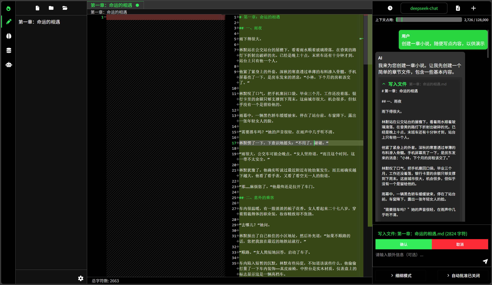

# 青烛 v0.2.0


## 项目介绍

青烛(正式名)是一个文本创作工具，主要探索AI在文本创作领域的应用。

**核心功能**:
*   **章节管理**: 创建、编辑、删除和组织章节。
*   **内容编辑器**: 强大的文本编辑功能，ai操作友好，非技术用户使用体验略逊
*   **工具调用**: 支持类似 vibecoding 的工具调用解决问题，目前部分功能仍在完善中。
*   **rag知识库**: 允许ai获得相关资料，提升效果
*   **mcp客户端**： 支持接入mcp服务器，stdio(npx/uvx)，http（streamable-http）, sse。
*   **skills支持**: 可以接入各种skills
*   **消息回档**: 消息自动存档，随时修改目标气泡。
*   **文件回档**：文件手动存档，允许进度回退。
*   **命令执行**： 允许ai直接执行命令，比如python,npm等
*   **终端**： 类似vscode等编辑器的终端面板，可执行命令行

## 技术栈

### 前端技术 (TypeScript)
*   **React**: 前端主流框架之一
*   **Redux**: 前端状态管理库
*   **Tailwind CSS**: CSS框架
*   **monaco-editor**: vscode同款编辑器

### 后端技术 (python)
*   **FastAPI**: python服务器框架
*   **LangChain**: 用于构建AI应用的工具链
*   **LangGraph**: 基于图的AI工作流编排框架
*   **ChromaDB**: 向量数据库，提供语义搜索和知识库管理


## Languages
Date : 2026-02-14 11:56:11
Total : 168 files,  13797 codes, 2811 comments, 2433 blanks, all 19041 lines

| language | files | code | comment | blank | total |
| :--- | ---: | ---: | ---: | ---: | ---: |
| TypeScript JSX | 70 | 7,183 | 481 | 904 | 8,568 |
| Python | 58 | 4,100 | 1,982 | 1,097 | 7,179 |
| TypeScript | 22 | 1,616 | 234 | 262 | 2,112 |
| JavaScript | 6 | 286 | 76 | 44 | 406 |
| Markdown | 3 | 224 | 0 | 86 | 310 |
| PostCSS | 4 | 183 | 19 | 30 | 232 |
| JSON | 2 | 132 | 0 | 2 | 134 |
| pip requirements | 1 | 30 | 0 | 0 | 30 |
| JSON with Comments | 1 | 29 | 19 | 7 | 55 |
| HTML | 1 | 14 | 0 | 1 | 15 |


## 已知问题

以下是目前已知但暂未修复的问题：

- **工具调用功能不完善**: 部分工具功能与其他功能（章节栏，标签页等）不协调

## 后续发展规划

### 短期目标（v0.2.0）
- 消息回档————类似cherrystudio的左右翻页还没做（暂时跳过）
- 重构，统一类型声明位置
- 新建一个专业的管家agent，删除三个内置模式，使用环境变量()
- 内容编辑器，无法实时显示最新的内容
- write_file工具 ———— 标签栏多了怎么处理，先看看两个栏的情况会创到哪里吧（）
- 文件操作工具，需要支持用户介入（）
- 系统提示词构建，需要将editor里面的标签也写进去（）
- 每次获取100个文件，超出100则自动转化为 不包括最底层 的“文件夹树”，再超过100个则再去掉一层。通过工具可以展开
- 长期记忆功能
- 分离mcp工具，按需加载
- 交接工具，或者直接让它改配置文件，允许AI直接更改自己的系统提示词
- 限制检索工具的结果数，避免上下文爆炸
- 临时添加工具结果/及时获取工具结果并渲染/中断返回结果时先返回state，让工具结果消息先渲染，再流式渲染中断消息（）
- 总结对话历史()————存在点小问题，比如，保留了倒数第二条消息，但是却显示没有发给ai
- 更新前可能要检查一下，CRLF和LF？windows和ubuntu混写的，好像有些在不同平台会出bug来着。

### 中期目标（v0.3.0）
- subagent，多agent系统
- git存档功能开始支持分支
- 部分功能自动化测试
- 多模态，上传图片
- 可视化工作流编辑器（类dify）
- 更灵活的AI聊天功能（类酒馆？？？）
- 工具加强
    - bug————当ai先前使用过工具（假如write_file），后续关闭使用该工具的权限与使用说明。一旦ai试图调用这个关闭的工具，就会报错。但是可控，渲染崩溃后，打开消息，删掉最后一个调用就好。
- 中断时通知提供商停止生成？这个需要参考别人的项目看看怎么实现的
- 没有API key，不允许在chromadb具体创建内容

- 允许用户打开文件夹作为工作目录
- apply_diff，暂时不需要模仿roo code等AI IDE的逻辑了，当前的逻辑应该够用。
- 新增memory_edit工具，允许ai直接编辑自己的上下文（？暂时还没有思路）


### 长期目标（v1.0.0）
- 暂无


## 快速开始

### 安装&启动

1.  **克隆仓库**:
    ```bash
    git clone git@github.com:FlickeringLamp/ai-novelist.git
    cd ai-novelist
    ```


2.  **安装前端依赖**:
    进入前端目录 (`frontend/`) 并安装依赖,构建前端，启动：
    ```bash
    cd frontend
    npm install
    npm run build
    npm start
    ```


3.  **安装后端依赖**:
    从根目录(`ai-novelist`)创建虚拟环境，激活，并安装后端依赖,回到根目录，启动：
    ```bash
    python -m venv backend_env
    backend_env\Scripts\activate
    cd backend
    pip install -r requirements.txt
    cd ..
    python main.py
    ```

4. **浏览器访问**：
    浏览器访问http://localhost:3000

5. **其他启动方式**:
    从根目录开始
    ```bash
    cd frontend
    npm run electron-dev
    ```

    **注意**：
    electron-dev启动时，可以使用终端功能，web端没有Node.js主进程，无法使用终端功能。


## 贡献

我们欢迎各种形式的贡献！如果您发现 Bug、有功能建议或希望提交代码，请随时通过 GitHub Issues 或 Pull Requests 参与。

为了保持项目的健康发展，请确保：
- 提交的代码与 [MIT 协议](LICENSE) 兼容
- 避免引入与 MIT 协议不兼容的代码

感谢每一位贡献者的支持！

## 许可证

本项目采用 [MIT 许可证](LICENSE)。


---

## 致谢 (Acknowledgements)

本项目的开发在一定程度上借鉴了 `roo-code` 项目。我们对 `roo-code` 的开发者们表示衷心的感谢。

`roo-code` 项目基于 Apache License 2.0 开源。根据其许可证要求，我们在项目中包含了其原始的许可证声明，您可以在 [`LICENSE-roo-code.txt`](./LICENSE-roo-code.txt) 文件中查看。
