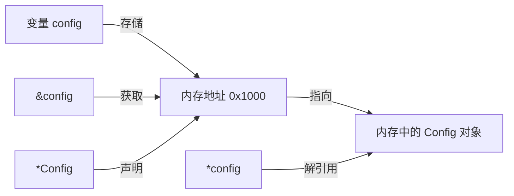

在 Go 语言中，`*` 和 `&` 都与**内存地址**相关，**跟磁盘没有关系**。它们不涉及磁盘上的数据，只涉及程序运行时的内存。

## 两个符号的含义

| 符号 | 名称 | 作用 |
|------|------|------|
| `&` | 取地址符 | **获取变量在内存中的地址** |
| `*` | 指针类型 / 解引用 | **声明指针类型** 或 **通过地址取到实际数据** |

## 结合你的代码举例

### 1. `*` 用于声明"指针类型"
```go
type App struct {
    config *updater.Config   // config 不是一个完整的 Config 对象，
                             // 而是"指向 Config 的内存地址"
}
```

这里 `*updater.Config` 表示：`config` 字段存储的不是 `Config` 结构体本身，而是该结构体在内存中的**地址**。

### 2. `&` 用于获取内存地址
```go
func NewApp() *App {
    return &App{}   // &App{} 表示：创建 App{}，然后返回它的内存地址,所以返回类型是*App
}
```

`&App{}` 做了两件事：
1. 在内存中分配一块空间存放 `App` 结构体
2. 返回这块空间的**内存地址**

所以 `NewApp()` 的返回值类型是 `*App`（App 的指针）。

### 3. `*` 用于解引用（通过地址拿到实际数据）
```go
func (a *App) GetMirror() string {
    if a.config == nil {
        return "tsinghua"
    }
    return a.config.Mirror   // a.config 是指针，但可以直接用 . 访问字段
}
```
为什么传入a，再传入*App，就能解引用，直接使用a.config
需要先澄清一个关键语法点：

func (a *App) GetMirror() string
这里的 (a *App) 不是"传入参数"，而是**方法接收器（receiver）**的声明。它在说："这个方法属于 *App 类型，方法体内用变量 a 来代表调用者"。

虽然 `a.config` 存的是内存地址，但 Go 会自动解引用，让你能像操作普通对象一样用 `.` 访问字段。

如果你想**显式地**解引用，也可以这样写（但不推荐，因为冗余）：
```go
return (*a.config).Mirror   // *a.config 表示"取出该地址里的实际 Config 对象"
```

### 4. 值传递 vs 指针传递
```go
func LoadConfig() (*updater.Config, error)   // 返回的是指针（内存地址）

config, err := updater.LoadConfig()         // config 接收的是地址
a.config = config                           // a.config 存储的是同一个地址
```

使用指针的好处是：**避免复制整个结构体**，多个地方共享同一块内存数据。

## 与磁盘数据的关系

如果你说的是**持久化到磁盘的数据**（比如配置文件、数据库），Go 中需要用专门的 IO 操作，例如：

```go
// 把内存数据写入磁盘（序列化）
data, _ := json.Marshal(config)
os.WriteFile("config.json", data, 0644)

// 从磁盘读入内存（反序列化）
data, _ := os.ReadFile("config.json")
json.Unmarshal(data, &config)   // 这里的 &config 也是取地址，让 Unmarshal 把数据填进这块内存
```

## 总结图



- **`&`**：拿到某块内存的**门牌号**（地址）
- **`*`**：表示"我存的是门牌号"，或者"按门牌号去屋里取东西"
- **磁盘**：需要用 `os`、`json`、`db` 等包显式读写，与 `*` `&` 无关